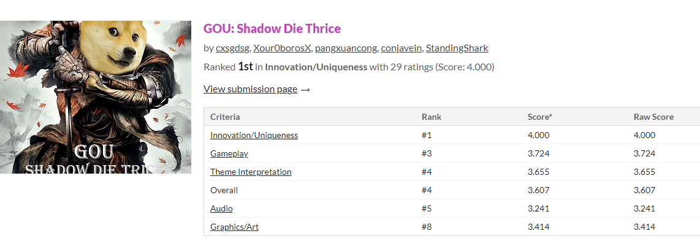
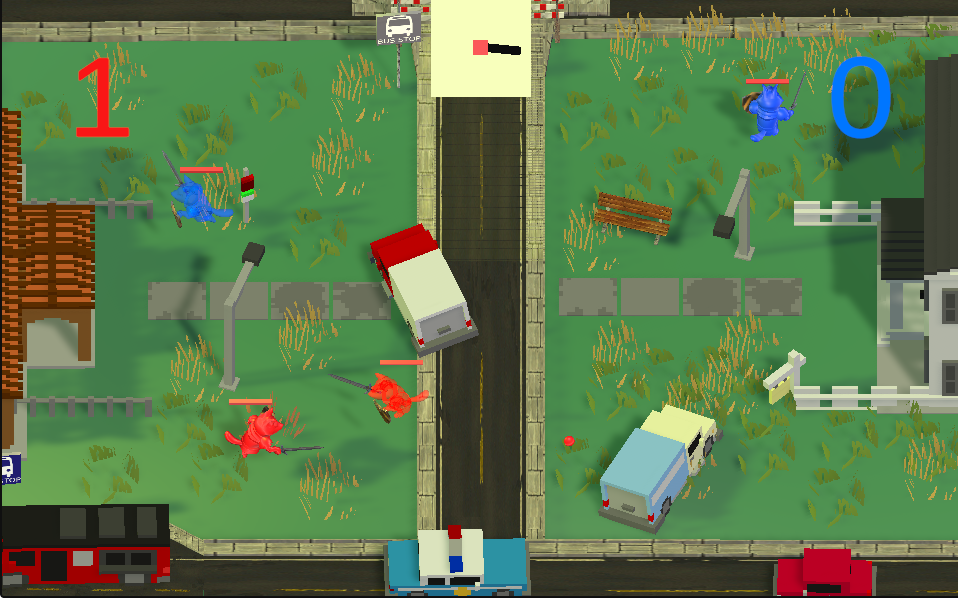
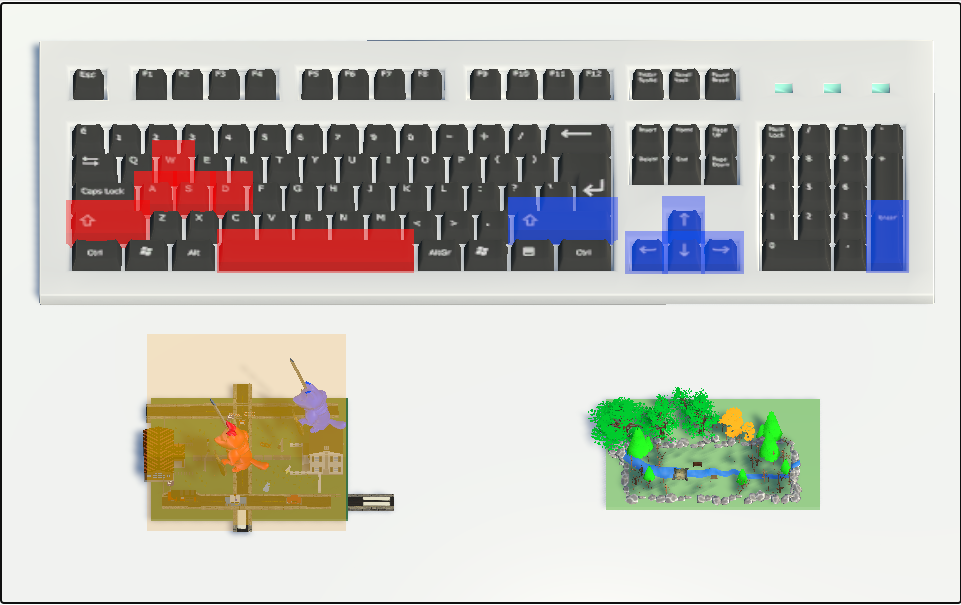
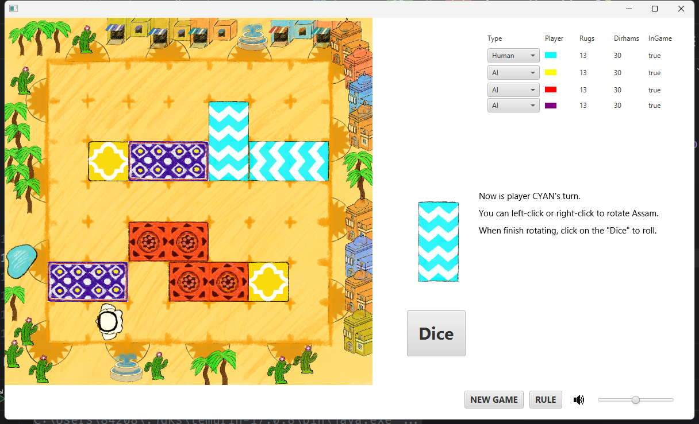
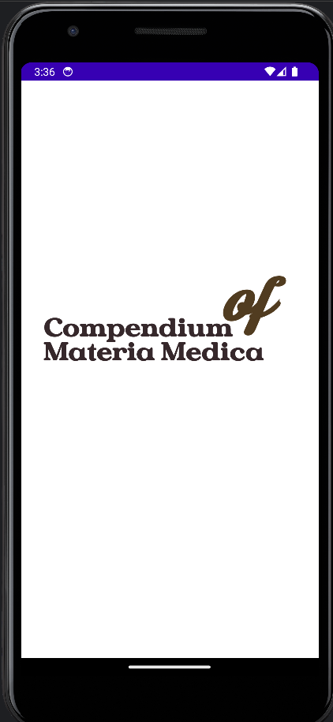
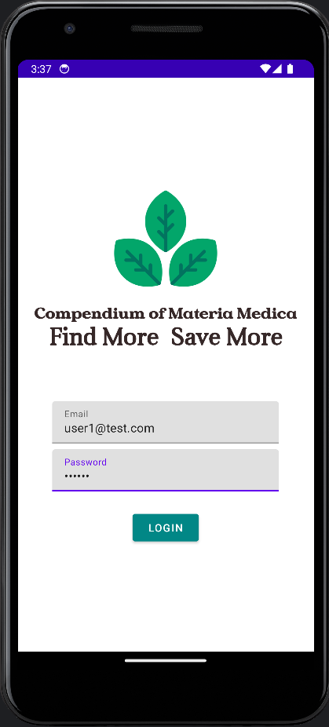
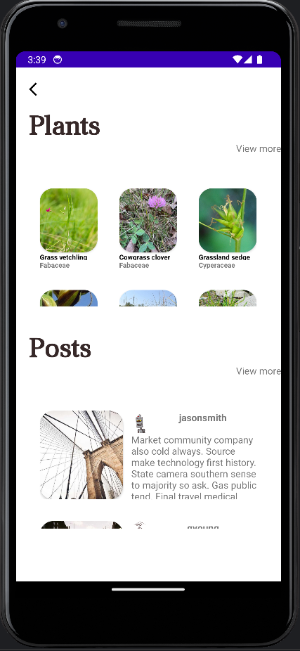
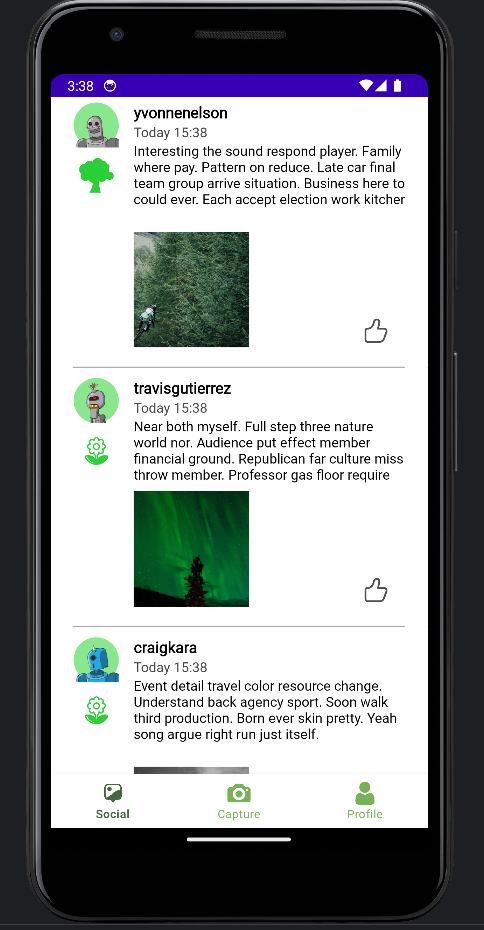
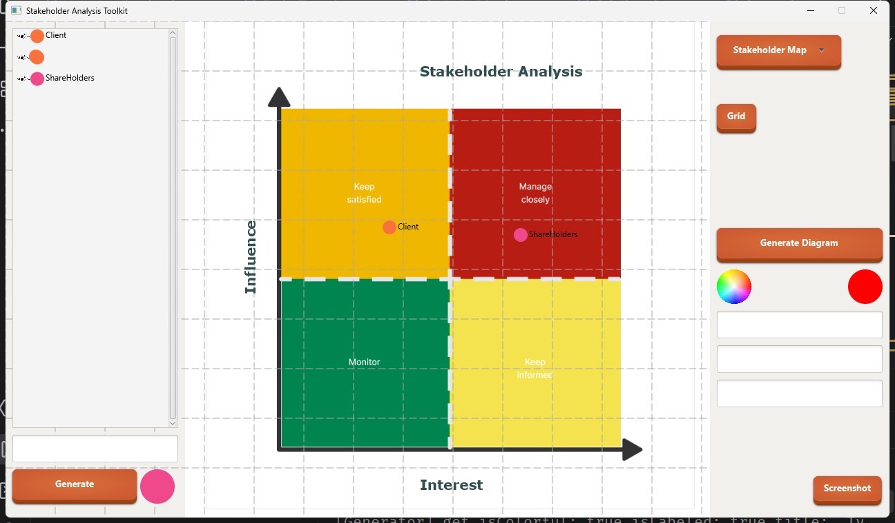

- 👋 Hi, I’m @StarChen4
- 👀 I’m interested in Game Development, Machine Learning
- 🌱 I’m currently learning Computing in Australian National University
- 💞️ I’m looking to collaborate on Making Games
- 📫 How to reach me : through email: cxsgdsg1@gmail.com
- 😄 Pronouns: He/Him

#Here are some of my major works：
- A GameJam game
- 
- 
- 

- A monopoly game
- - 
- 

- An Android app
-    

- A Java software
- 
<!---
StarChen4/StarChen4 is a ✨ special ✨ repository because its `README.md` (this file) appears on your GitHub profile.
You can click the Preview link to take a look at your changes.
--->
